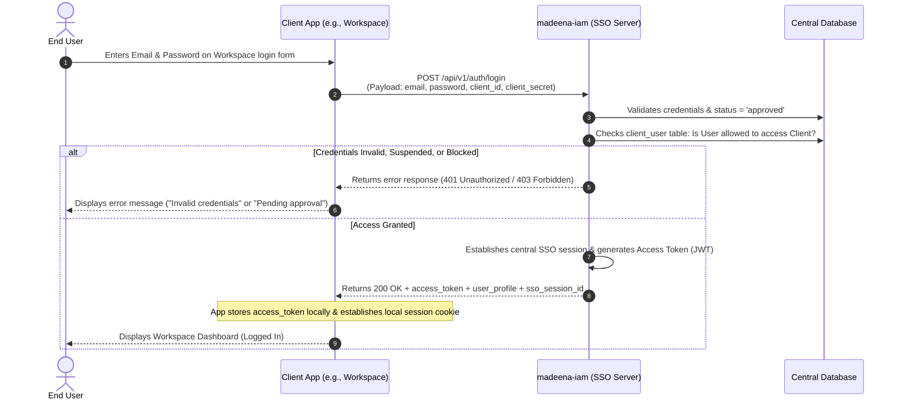
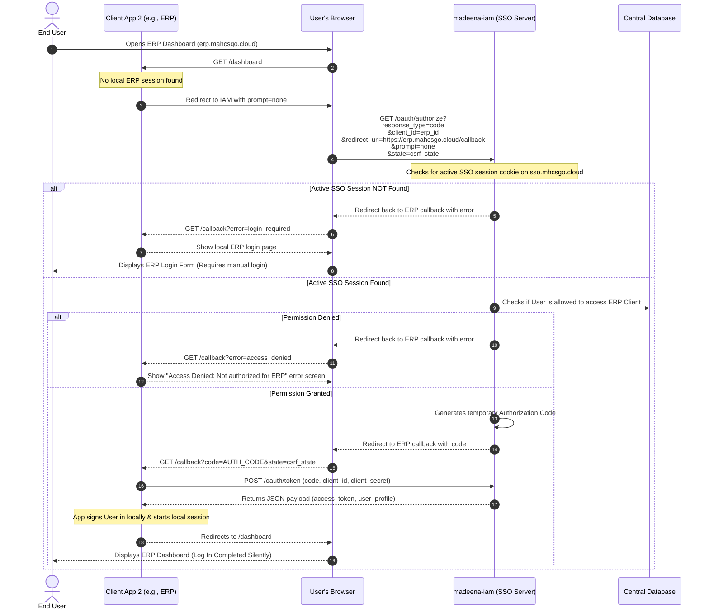

# Madeena IAM (Identity & Access Management)

[](https://laravel.com)
[](https://filamentphp.com)
[](https://php.net)
[](https://opensource.org/licenses/MIT)

Madeena IAM is a centralized Identity & Access Management (IAM) and Single Sign-On (SSO) server. It serves as the single source of truth for user credentials, profiles, device sessions, and access permissions across the entire Madeena ecosystem (including `simama` portal, `madeena-workspace`, `madeena-erp`, and `madeena-it`).

---

## 🚀 Key Features

* **Centralized Single Sign-On (SSO) & Sign-Out (SLO):** Authenticate once on `madeena-iam` and gain seamless, password-free access to all other authorized applications.
* **SSO Silent Session Sync (`prompt=none`):** Leverage standard OAuth2/OIDC `prompt=none` redirect flow to silently sign users in if they have an active central session on `sso.mhcsgo.cloud` (fully compliant with modern 3rd-party cookie restrictions).
* **Direct API Authentication (No Redirects):**
  * `POST /api/v1/auth/login`: Direct server-to-server validation (credentials, client authorization, and registration status checks).
  * `POST /api/v1/auth/register`: Forwards user registrations to IAM where they are created in a `pending_approval` state.
* **Granular Access Mappings:** Toggle access to specific client applications per user via the administration panel, blocking unauthorized users at the gateway.
* **Device Session Management & Remote Revocation:** View active sessions (IP, device, user-agent) and terminate them remotely (automatically logging the user out).
* **Audit Trail Logging:** Keep secure logs of all logins, logouts, IPs, user agents, accessed client applications, and status reasons (`success`, `failed_password`, `blocked_app`, etc.).
* **Central Admin Panel:** Admin dashboard built with Filament v5 for client registration, user approval, access provisioning, and activity monitoring.

---

## 🛠️ Technology Stack

* **Backend Engine:** PHP 8.4+
* **Framework:** Laravel 13 (utilizing Laravel Passport for OAuth2/OIDC token engines)
* **Admin Dashboard:** Filament v5
* **Frontend Assets:** Alpine.js, Tailwind CSS v4, and Vite 8
* **Database Engine:** MySQL 8.4 (Isolated DB Instance)
* **Testing Suite:** PHPUnit 12.5.x (using Mockery 1.6 & Faker 1.23)

> [!IMPORTANT]
> **Database Isolation Rule:** To maintain absolute security, security audits, and architectural independence, `madeena-iam` **MUST** run on a completely separate database server instance, sharing zero tables or credentials with client applications.

---

## ⚙️ Project Architecture & Flows

### 1. Direct API Login Flow (No Redirects)


### 2. SSO Silent Session Check Flow (`prompt=none`)


---

## 🗄️ Database Schema Design

* **`users`:** Holds primary identity credentials and status markers.
* **`oauth_clients`:** Manages client details, logos, activation status, and access secrets (configured via Laravel Passport and Filament).
* **`client_user`:** Pivot table maps application permissions to individual users with status tracking (`pending_approval`, `approved`, `suspended`).
* **`authentication_logs`:** Audit trail for tracking user authentication lifecycle (polymorphic logs for login and logout events, geolocation support, and status classification).

---

## 💻 Local Development Setup

Madeena IAM employs a **hybrid development architecture** to optimize performance inside WSL (Windows Subsystem for Linux):
* PHP, Composer, and NPM packages run directly on the host WSL system.
* MySQL containerized infrastructure runs isolated via Docker Compose.

### Prerequisites
Make sure you have the following installed on your machine:
* PHP 8.4+
* Composer
* Node.js & NPM
* Docker & Docker Compose

### 📥 1. Clone & Set Up environment
Run the automated initialization script:
```bash
# Provision application, copy environment variables, build assets, and run migrations
./deploy-local.sh
```

To perform a fresh reset of the database, run:
```bash
./deploy-local.sh --fresh
```

To configure the workspace without starting the development server immediately:
```bash
./deploy-local.sh --no-start
```

### 🏃‍♂️ 2. Developer Commands
* **Start Dev Server (server, queue, logs, and Vite concurrently):**
  ```bash
  composer dev
  ```
* **Run Tests (PHPUnit):**
  ```bash
  composer test
  ```
* **Linting & Code Style Formatting:**
  ```bash
  ./vendor/bin/pint
  ```
* **Stop Infrastructure Container:**
  ```bash
  docker compose -f docker-compose.local.yml down
  ```

---

## 🤖 AI Control Center

For developers using AI coding assistants (e.g., Cursor, Claude Code, Antigravity):
* The system utilizes a state retention directory at [`.ai/`](file:///.ai/).
* Please read [`.ai/README.md`](file:///.ai/README.md) and respect the conventions defined in [`.ai/rules/`](file:///.ai/rules/) prior to initiating any development task.
