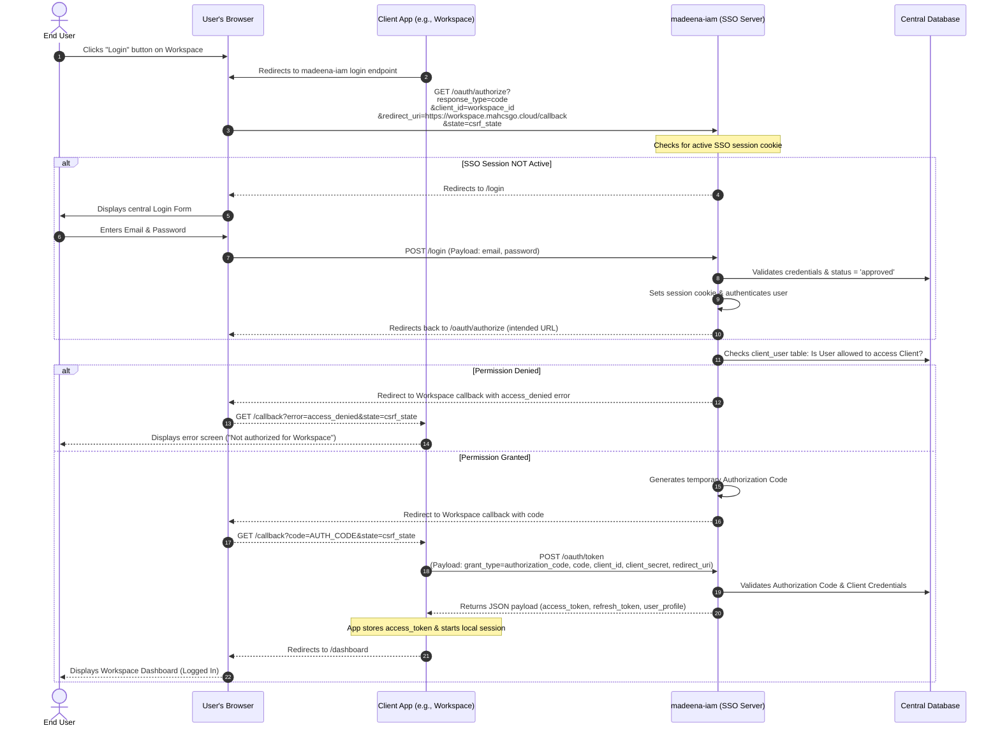
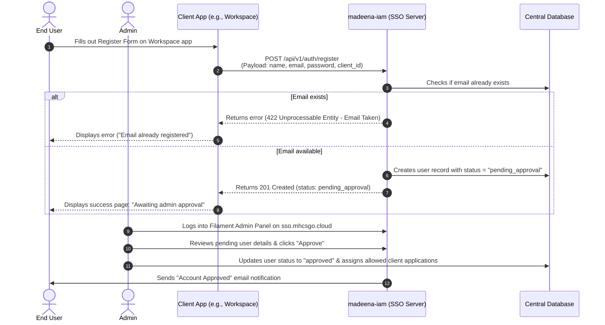
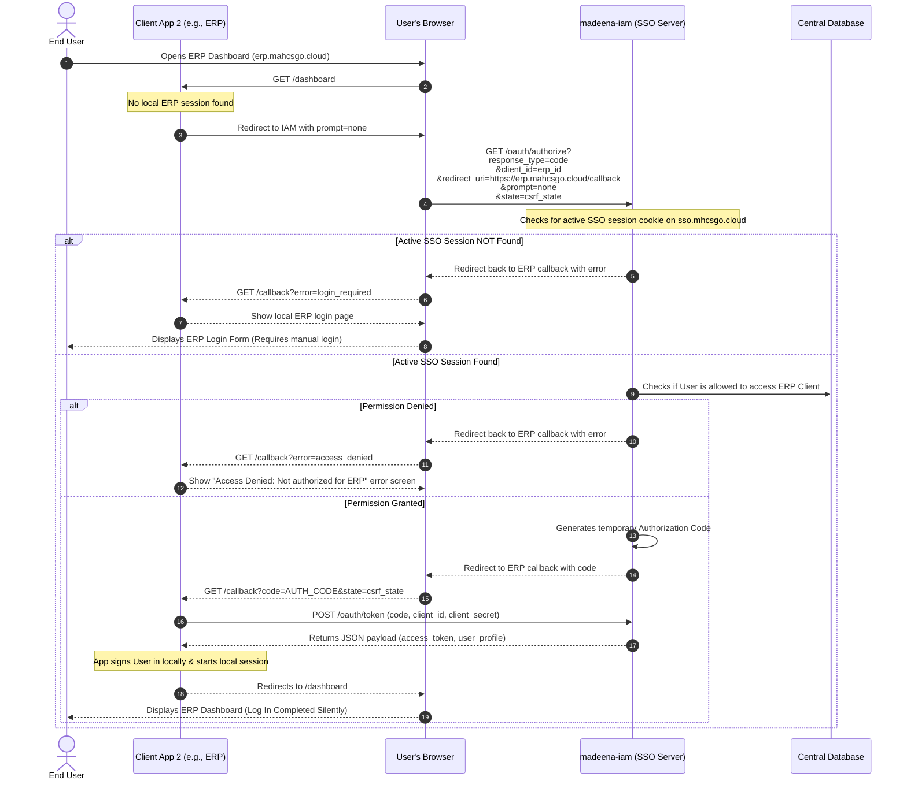
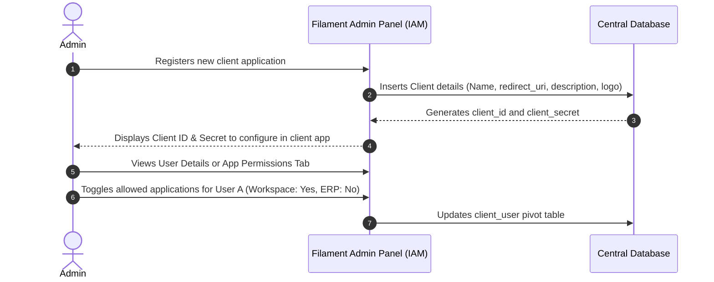
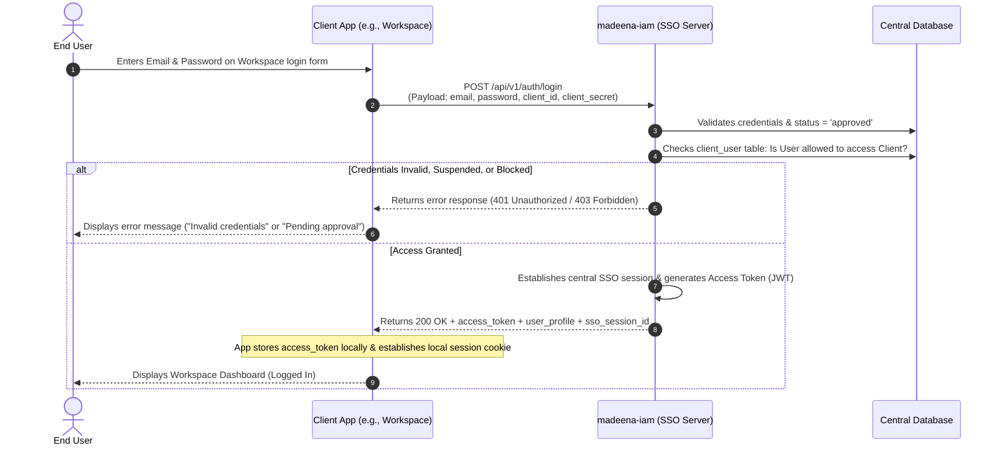

# Product Requirements Document (PRD)
## Project Name: madeena-iam (Identity & Access Management)

---

## 1. Executive Summary
`madeena-iam` is a centralized Identity and Access Management (IAM) and Single Sign-On (SSO) server. It serves as the single source of truth for user credentials, profiles, sessions, and access permissions across the Madeena ecosystem (including `simama` portal, `madeena-workspace`, `madeena-erp`, and `madeena-it`).

Instead of duplicating user databases and login flows across multiple applications, `madeena-iam` centralizes authentication, monitors active user sessions, tracks security logs, and manages which users are permitted to access which services.

---

## 2. Core Objectives
* **Centralized Authentication (SSO):** Users log in once to `madeena-iam` and gain seamless, password-free access to all other authorized applications.
* **Granular Access Control:** Admins can grant or revoke a user's access to specific applications (e.g., Workspace, ERP, IT Tools) from a single control panel.
* **Audit & Compliance Logs:** Track user login history (timestamp, IP address, device, location, and target application).
* **Active Session Management:** Allow users and admins to view active device sessions and remotely terminate them.
* **Consistent User Experience:** Utilize Laravel, Filament, and Tailwind CSS to ensure a unified visual design.

---

## 3. Technology Stack
* **PHP Engine:** v8.4+
* **Framework:** Laravel 13 (leveraging Laravel Passport for OAuth2/OIDC token engines)
* **Admin Dashboard:** Filament v5 (for user management, registrations, and application registries)

---

## 4. System Architecture & Flow

### 4.1. Detailed OAuth2 Redirect Login Flow (Standard SSO - Primary)
In this primary flow, the user clicks login on the Client Application, and the Client App redirects the user's browser to the central SSO Server. The user submits credentials directly to the IAM server, and upon successful authentication, is redirected back to the Client Application with an authorization code.

---

### 4.2. Detailed API Registration Flow (With Admin Verification)
Each client application renders its own registration form. The registration details are forwarded to `madeena-iam` via a secure API endpoint.

---

### 4.3. SSO Silent Session Check Flow (Flexibility Option B)
When the user visits a second application (e.g., ERP) after having logged into Workspace, the second application checks if they already have an active central session on `madeena-iam` without requesting credentials again. This is achieved via a quick, silent browser redirect using the standard `prompt=none` OAuth2 pattern (fully compatible with modern third-party cookie restrictions).

---

### 4.4. Admin Configuration Flow (App Registry & Access Provisioning)

---

### 4.5. Alternative Direct API Login Flow (No Redirects - Secondary)
For cases where redirect-based authentication is not suitable (such as native mobile applications or command-line interfaces), `madeena-iam` provides a direct backend credential-verification API. In this flow, the client app displays the login form, collects the user's email and password, and makes a server-to-server request to IAM.

---

## 5. Functional Requirements

### 5.1. Authentication & Single Sign-On (SSO)
* **API-Driven Credentials Verification:** Provide clean backend endpoints (`POST /api/v1/auth/login` and `POST /api/v1/auth/register`) for client applications to verify passwords and sign up users directly.
* **OAuth2 / OIDC Engine:** Leverage Laravel Passport to issue standard Access Tokens and User Info.
* **Silent Session Sync (prompt=none):** Support the standard OIDC `prompt=none` redirect logic so client apps can silently verify if a user has an active session cookie on `sso.mhcsgo.cloud` and sign them in automatically.
* **Social Logins (Future Expansion):** Scaffolding for Social Identity Providers (Google, etc.) will be structured to allow easy integration in Phase 2, but is disabled/deferred for the initial launch.
* **Single Sign-Out (SLO):** Logging out of any client application will trigger a backend or front-channel call to destroy the active SSO session on the central IAM server.

### 5.2. Application & Access Management (Admin Panel)
* **Application Registry:** Admins can register applications with:
  * Name
  * Client ID & Secret
  * Redirect URIs
  * Enabled/Disabled Status
  * Description
* **Direct User Registration:** Admins can manually register/create users directly from the Filament Admin Panel (automatically creating the user in `approved` status, assigning initial app permissions, and triggering an onboarding email to let the user set their password).
* **Access Mapping:** Admins can assign users to specific applications or revoke their permission.
* **Access Guard:** When authentication is requested for a specific Client ID, the system must verify that the user is explicitly allowed to access that application.
* **Global Account Approvals:** Review new registrations, toggle user statuses (`pending_approval`, `approved`, `suspended`), and activate accounts.

### 5.3. Security, Sessions & Audit Logs
* **Device Session Tracking:** List all devices/browsers currently logged into the user's account.
* **Remote Session Revocation:** Users can revoke/terminate any active session (including their current one, which logs them out).
* **Login History log:** Database log storing:
  * User ID
  * Application accessed (Client ID)
  * IP Address
  * User Agent (Browser, Operating System)
  * Location (via GeoIP integration, optional)
  * Authentication Type (Password vs. Google)
  * Success/Failure Status

---

## 6. Database Schema Design

### `users`
Central user directory.
* `id` (UUID, Primary Key)
* `name` (string)
* `email` (string, unique)
* `password` (string)
* `remember_token` (string, nullable)
* `created_by` / `updated_by` / `deleted_by` (UUID, nullable)
* `created_at` / `updated_at` / `deleted_at` (timestamp, nullable)

### `oauth_clients` (Managed by Laravel Passport / Custom)
Stores client application details.
* `id` (UUID, Primary Key)
* `name` (string)
* `secret` (string, nullable)
* `provider` (string, nullable)
* `redirect_uris` (text)
* `grant_types` (text)
* `revoked` (boolean)
* `app_logo_path` (string, nullable)
* `description` (string, nullable)
* `is_active` (boolean, default true)
* `owner_type` / `owner_id` (string/bigint, nullable morphs)
* `created_by` / `updated_by` / `deleted_by` (UUID, nullable)
* `created_at` / `updated_at` / `deleted_at` (timestamp, nullable)

### `client_user` (Pivot Table)
Defines user access rules to apps.
* `id` (bigint, Primary Key)
* `user_id` (foreignUuid to `users`)
* `client_id` (foreignUuid to `oauth_clients`)
* `client_app_user_id` (string, nullable)
* `status` (enum: `'pending_approval'`, `'approved'`, `'suspended'`, default: `'pending_approval'`)
* `approved_at` (timestamp, nullable)
* `approved_by` (foreignUuid to `users`, nullable)
* `is_blocked` (boolean, default false)
* `created_by` / `updated_by` / `deleted_by` (UUID, nullable)
* `created_at` / `updated_at` / `deleted_at` (timestamp, nullable)

### `authentication_logs`
The audit trail (polymorphic and tracks both login and logout activities).
* `id` (bigint, Primary Key)
* `authenticatable_id` (UUID, nullable polymorphic relation to `users`)
* `authenticatable_type` (string, nullable polymorphic relation to `users`)
* `client_id` (foreignUuid to `oauth_clients`, nullable)
* `ip_address` (string, 45, nullable)
* `user_agent` (text, nullable)
* `login_at` (timestamp, nullable)
* `logout_at` (timestamp, nullable)
* `login_successful` (boolean, default false)
* `cleared_by_user` (boolean, default false)
* `location` (json, nullable)
* `status` (string, nullable: e.g. `'success'`, `'failed_password'`, `'blocked_app'`, `'invalid_client'`)
* `auth_type` (string, nullable: e.g. `'password'`, `'google'`)

---

## 7. Non-Functional Requirements
* **Database Isolation:** To maintain absolute security, security audits, and architectural independence, `madeena-iam` MUST run on a completely separate database server instance, sharing zero tables or credentials with the client applications.
* **Security:** Cryptographically signed tokens (JWT / OIDC). Strict session-cookie configuration (`Secure`, `HttpOnly`, `SameSite=Lax`).
* **Performance:** Login token verifications and exchanges must complete in <100ms.
* **Design & Aesthetics:** Responsive, highly premium visual style using HSL color tokens, smooth dark-mode transitions, and a modern layout mimicking premium systems (like Apple ID or Stripe Dashboard).
* **API Documentation:** Comprehensive documentation of OIDC endpoints so custom client apps (PHP, JS, Python) can connect.
