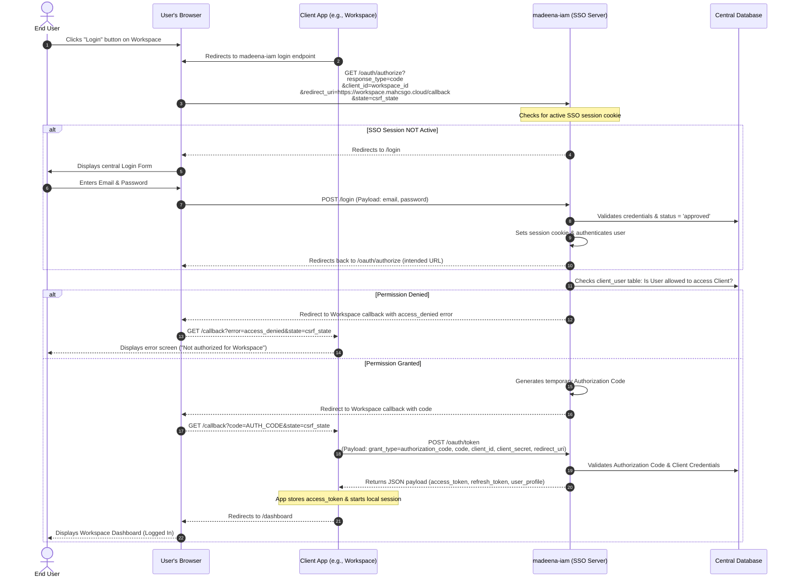
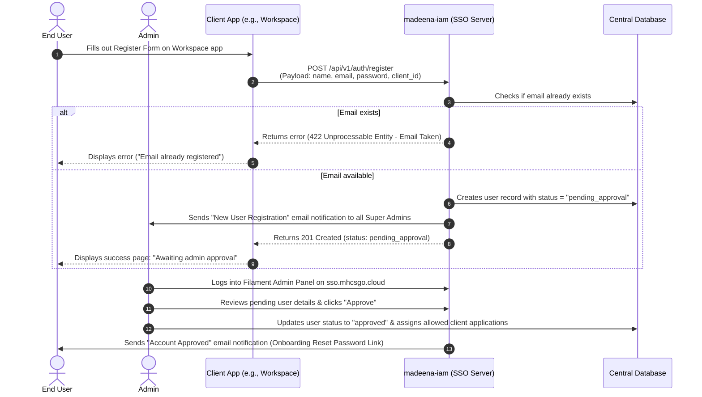
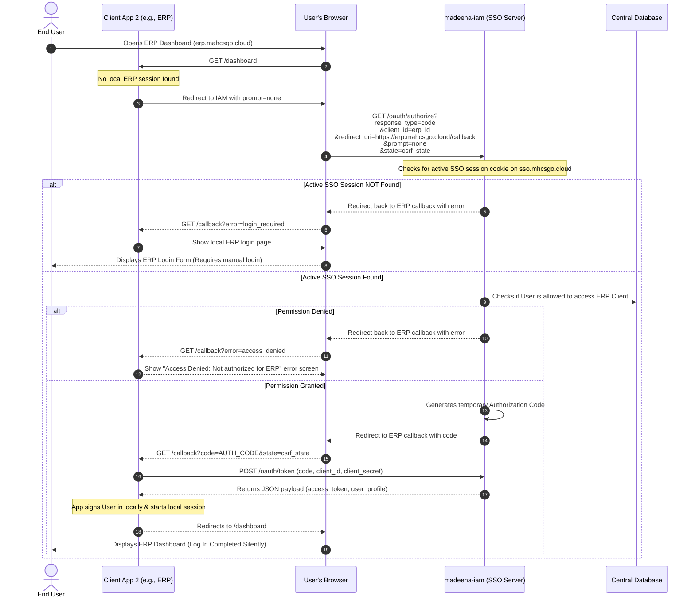
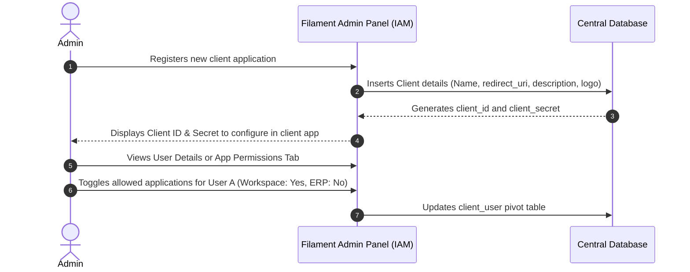
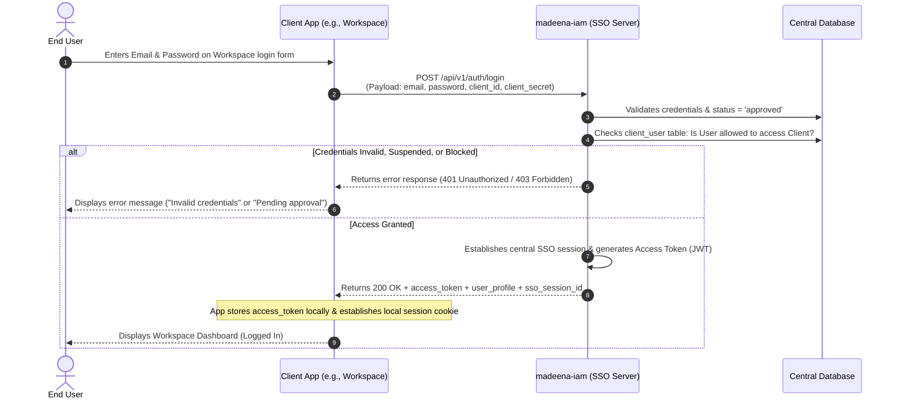
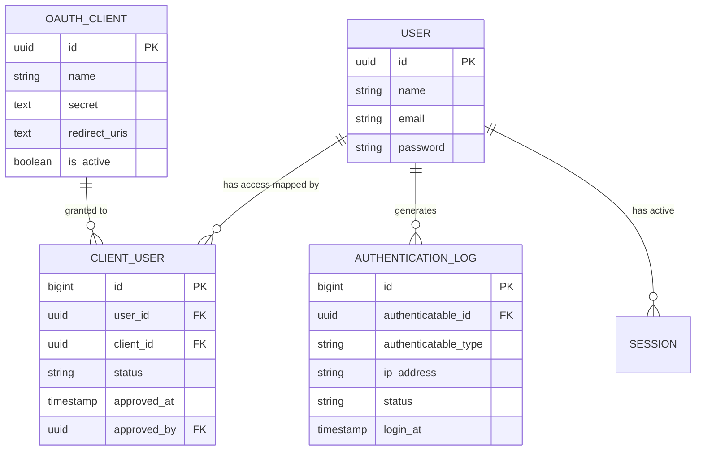
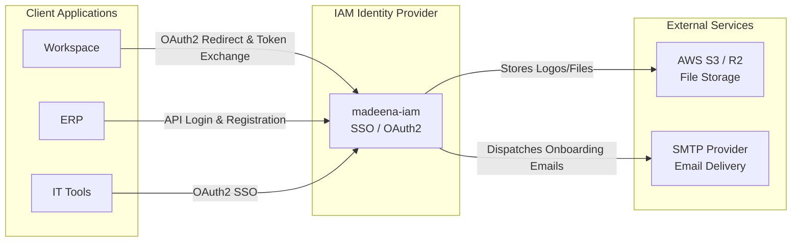

# Product Requirements Document (PRD)
# Madeena IAM (Identity & Access Management)

> **Last Updated**: 2026-06-10  
> **Version**: 1.0  
> **Status**: Living Document — Auto-generated from codebase analysis  
> **Generated by**: AI Product Engineer

---

## 1. Product Overview

### 1.1 What is Madeena IAM?
`madeena-iam` is a centralized Identity and Access Management (IAM) and Single Sign-On (SSO) server. It serves as the single source of truth for user credentials, profiles, sessions, and access permissions across the Madeena ecosystem (including `simama` portal, `madeena-workspace`, `madeena-erp`, and `madeena-it`).

Instead of duplicating user databases and login flows across multiple applications, `madeena-iam` centralizes authentication, monitors active user sessions, tracks security logs, and manages which users are permitted to access which services.

### 1.2 Tech Stack Summary
| Layer | Technology | Version |
|---|---|---|
| Backend Framework | Laravel | 13.x |
| Frontend | Alpine.js, Tailwind CSS | v4 |
| Admin Panel | Filament | v5.x |
| Authentication Engine | Laravel Passport | 13.0 |
| Database | MySQL | 8.4 (Isolated Instance) |
| Server | PHP | 8.4+ |

### 1.3 Key URLs / Entry Points
| URL Pattern | Purpose | Auth Required |
|---|---|---|
| `/oauth/authorize` | Central SSO Authorization | No (Redirects if no session) |
| `/login` | Central Login Form | No |
| `/password-reset/{token}` | Password Reset Form | No |
| `/admin` | Filament Admin Dashboard | Yes (`super_admin` only) |
| `/api/v1/auth/login` | Direct API Login Validation | No (Client Creds required) |
| `/api/v1/auth/register` | Direct API User Registration | No |

---

## 2. User Personas & Roles

### 2.1 Super Admin
- **Description**: System administrator who manages applications and controls user access within the Madeena ecosystem.
- **Access Level**: Full access to the Filament Admin panel.
- **Key Workflows**: Registering new OAuth clients, approving new user registrations, suspending users, mapping access, and monitoring authentication logs.

### 2.2 End User
- **Description**: Employees or clients interacting with applications inside the Madeena ecosystem (Workspace, ERP, IT Tools).
- **Access Level**: Access to designated client applications via SSO. No access to the central IAM Admin dashboard.
- **Key Workflows**: Logging in via SSO, viewing their active device sessions, and remotely logging out of sessions.

### 2.3 Access Control Matrix
| Feature / Resource | Super Admin | End User | Public / Client Apps |
|---|---|---|---|
| Admin Dashboard (`/admin`) | ✅ | ❌ | ❌ |
| View/Manage Active Sessions | ✅ | ✅ | ❌ |
| Authenticate via SSO | ✅ | ✅ | ❌ |
| Register New Users | ✅ | ❌ | ✅ |
| Approve Registrations | ✅ | ❌ | ❌ |

---

## 3. Feature Inventory

### 3.1 Authentication & SSO

#### F-001: Centralized Single Sign-On (SSO)
- **Description**: Redirect-based OAuth2 login flow allowing password-free access to authorized client apps.
- **User Roles**: End User, Super Admin
- **Routes**: `GET /oauth/authorize`, `POST /login`
- **Key Components**: `AuthorizationController`, `LoginController`
- **Business Rules**: Checks if user is approved (`status = approved`) and permitted for the specific client app (`client_user` table pivot).

#### F-002: Direct API Login
- **Description**: Backend endpoint for applications that cannot use browser redirects (e.g., native mobile applications).
- **User Roles**: End User
- **Routes**: `POST /api/v1/auth/login`
- **Key Components**: `Api\V1\AuthController`
- **Business Rules**: Validates credentials and client access mapping. Generates Access Token (JWT) and establishes a central SSO session.

#### F-003: Silent Session Sync (`prompt=none`)
- **Description**: Allows apps to silently check for an active central session without requesting credentials again.
- **User Roles**: End User, Super Admin
- **Routes**: `GET /oauth/authorize?prompt=none`
- **Business Rules**: Standard OIDC behavior utilizing session cookies on `sso.mhcsgo.cloud`.

### 3.2 Access Management

#### F-004: Direct User Registration API
- **Description**: API endpoint for external client apps to forward user registrations to IAM.
- **User Roles**: Public / Client Apps
- **Routes**: `POST /api/v1/auth/register`
- **Key Components**: `Api\V1\AuthController`
- **Business Rules**: Creates the user in a `pending_approval` state. Sends "New User Registration" email to all Super Admins.

#### F-005: Admin App & User Management
- **Description**: Filament-based dashboard to register new applications, map users to applications, and approve pending accounts.
- **User Roles**: Super Admin
- **Routes**: `/admin/*`
- **Key Components**: Filament Resources
- **Business Rules**: Updating a user status to `approved` automatically dispatches a queued job to send an Onboarding/Password Reset email to the user.

### 3.3 Security & Sessions

#### F-006: Device Session Management
- **Description**: Allows users to view and revoke any of their active sessions remotely.
- **User Roles**: End User
- **Routes**: `GET /api/v1/sessions`, `DELETE /api/v1/sessions/{id}`
- **Key Components**: `Api\V1\DeviceSessionController`
- **Business Rules**: Revoking a session instantly logs the user out from that specific device.

#### F-007: Audit Logging
- **Description**: Logs login/logout events securely to the database.
- **User Roles**: System (Viewable by Super Admin)
- **Key Components**: `AuthenticationLog` Model, Spatie ActivityLog
- **Business Rules**: Records IP address, User Agent, Location, Authentication Type, and Success/Failure statuses.

---

## 3.5 Application Flows

### 3.5.1 Detailed OAuth2 Redirect Login Flow (Standard SSO - Primary)

### 3.5.2 Detailed API Registration Flow (With Admin Verification)

### 3.5.3 SSO Silent Session Check Flow (`prompt=none`)

### 3.5.4 Admin Configuration Flow (App Registry & Access Provisioning)

### 3.5.5 Direct API Login Flow (No Redirects - Secondary)

---

## 4. Data Model

### 4.1 Entity Relationship Overview
The system centers around the `User` and `OauthClient` models. A pivot table `client_user` maps which users can access which clients and tracks their individual approval status per client. The `AuthenticationLog` securely records every login/logout attempt associated with a user or system.

### 4.2 Database Schema

#### `users`
| Column | Type | Constraints | Description |
|---|---|---|---|
| `id` | uuid | PK | Primary Key |
| `name` | string | | User's full name |
| `email` | string | unique | User's email address |
| `password` | string | | Hashed password |

#### `oauth_clients`
| Column | Type | Constraints | Description |
|---|---|---|---|
| `id` | uuid | PK | Passport client ID |
| `name` | string | | Name of the client app |
| `secret` | text | | Client secret (encrypted) |
| `redirect_uris` | text | | Allowed OAuth redirect URLs |
| `is_active` | boolean | | App active status |

#### `client_user` (Pivot)
| Column | Type | Constraints | Description |
|---|---|---|---|
| `id` | bigint | PK | Pivot Primary Key |
| `user_id` | uuid | FK -> `users` | The user ID |
| `client_id` | uuid | FK -> `oauth_clients` | The app ID |
| `status` | string | | `pending_approval`, `approved`, `suspended` |
| `approved_at` | timestamp | | When the user was approved |

#### `authentication_logs`
| Column | Type | Constraints | Description |
|---|---|---|---|
| `id` | bigint | PK | Primary Key |
| `authenticatable_id` | uuid | FK -> `users` | Polymorphic User ID |
| `ip_address` | string | | Login IP Address |
| `status` | string | | Success / Blocked status |

### 4.3 ER Diagram

> [!IMPORTANT]
> The ER diagram directly reflects the migrations and model configurations for absolute data isolation from the rest of the Madeena ecosystem.

---

## 5. Integrations & External Services

### 5.1 AWS S3 / R2 File Storage
- **Purpose**: Storage of application assets, user profile images, and OAuth Client logos.
- **Configuration**: `AWS_ACCESS_KEY_ID`, `AWS_SECRET_ACCESS_KEY`, `AWS_DEFAULT_REGION`, `AWS_BUCKET`
- **Usage**: Invoked globally via Laravel `Storage::disk('s3')`.

### 5.2 SMTP Email
- **Purpose**: Delivering "New User Registration" alerts to Super Admins and "Onboarding / Set Password" links to newly approved users.
- **Configuration**: `MAIL_MAILER`, `MAIL_HOST`, `MAIL_PORT`, `MAIL_USERNAME`, `MAIL_PASSWORD`
- **Usage**: Used via Queued Mailables (`OnboardingMail`, `NewUserRegistrationAdminMail`).

### 5.x Integration Architecture Diagram

---

## 6. Non-Functional Requirements

### 6.1 Performance
- **Queue Usage**: Registration emails and onboarding emails are pushed to the database queue (`queue:listen`) to keep API response times minimal.
- **Caching**: Configured via database or Memcached (`CACHE_STORE`).
- **Response Times**: Token verifications and back-channel token exchanges must complete in <100ms.

### 6.2 Security
- **Authentication Method**: Cryptographically signed tokens (JWT / OIDC) generated by Laravel Passport.
- **Authorization**: Role-based access control inside the Admin panel (Spatie Permissions). Strict per-client authorization checks (`client_user` mapping).
- **Isolation Rule**: `madeena-iam` MUST run on an entirely isolated database server instance.
- **Session Tokens**: Strict session-cookie configuration (`Secure`, `HttpOnly`, `SameSite=Lax`).

### 6.3 Deployment
- **Server Environment**: Requires PHP 8.4+, Node.js for Vite asset compilation.
- **Environment Management**: Requires secure configuration of `APP_KEY`, Passport Keys, and Database credentials.

---

## 7. Current Limitations & Technical Debt
- **Social Logins Disabled**: Code structure might support social identities (Google/SSO), but it is currently disabled/deferred for initial launch.
- **Local Dev Architecture**: Uses a hybrid approach (WSL host for PHP, Docker for MySQL), which requires specific initialization scripts (`./deploy-local.sh`).

---

## 8. Future Considerations
- **Phase 2 Expansion**: Enable and configure Social Logins (Google, Microsoft, etc.) as primary identity providers.
- **Geographic Auditing**: Integrate a GeoIP service to populate the `location` field in the `authentication_logs` securely.

---

## Appendix

### A. Environment Variables Reference
| Variable | Purpose | Required | Default |
|---|---|---|---|
| `APP_URL` | Application root URL | Yes | `http://localhost` |
| `DB_CONNECTION` | Database driver | Yes | `sqlite` |
| `QUEUE_CONNECTION` | Driver for async background jobs | Yes | `database` |
| `MAIL_MAILER` | Mail sending driver | Yes | `log` |
| `AWS_BUCKET` | S3 compatible storage bucket | No | |

### B. Artisan Commands
| Command | Purpose | Schedule |
|---|---|---|
| `queue:listen` | Process async jobs (Registration / Onboarding Emails) | Continuous daemon |

### C. API Endpoints
| Method | Endpoint | Auth | Description |
|---|---|---|---|
| `POST` | `/api/v1/auth/login` | None | Verify credentials directly (requires Client ID/Secret) |
| `POST` | `/api/v1/auth/register` | None | Register new user as pending |
| `GET` | `/api/v1/user` | Bearer | Get current authenticated user profile |
| `POST` | `/api/v1/auth/logout` | Bearer | Invalidate token and session |
| `GET` | `/api/v1/sessions` | Bearer | List active device sessions |
| `DELETE`| `/api/v1/sessions/{id}`| Bearer | Revoke a session |
