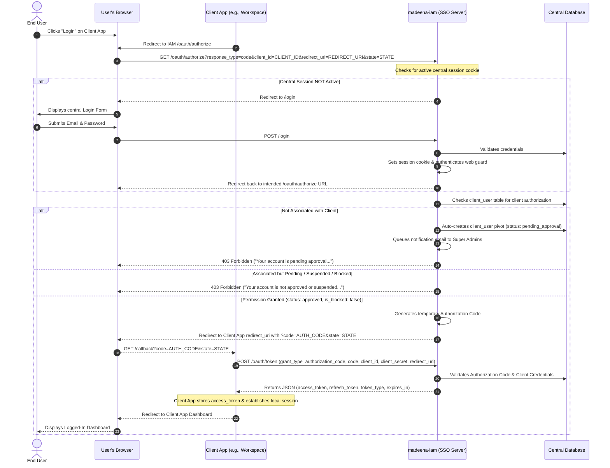
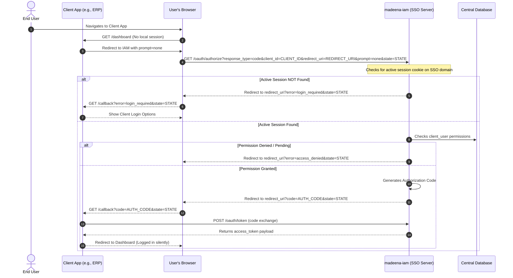
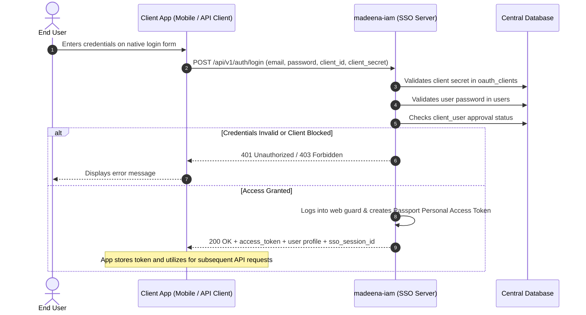
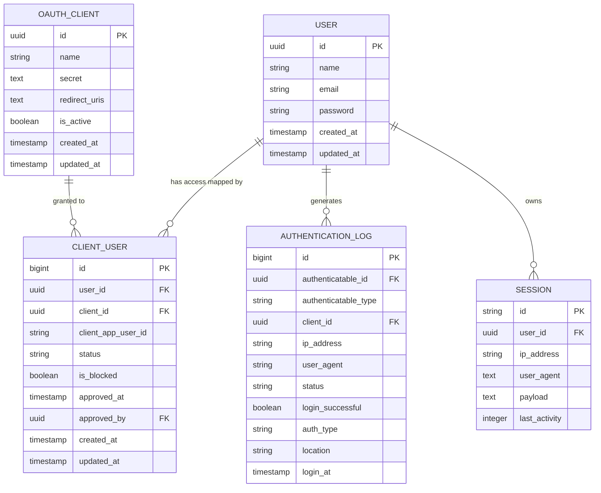

# Product Requirements Document (PRD)
# Madeena IAM (Identity & Access Management)

> **Document ID**: PRD-IAM-001
> **Status**: Living Document — Reconciled with Implementation Reality
> **Language**: en-US
> **Applies to**: `madeena-iam` core product & API surfaces

---

## 1. Product Overview

### 1.1 What is Madeena IAM?
`madeena-iam` is a centralized Identity and Access Management (IAM) and Single Sign-On (SSO) server. It serves as the single source of truth for user credentials, profiles, device sessions, and application access permissions across the Madeena ecosystem (including `simama` portal, `madeena-workspace`, `madeena-erp`, and `madeena-it`).

Instead of duplicating user databases and authentication logic across multiple applications, `madeena-iam` centralizes authentication, monitors active user sessions, tracks security audit logs, and enforces per-client user authorization through an administrative approval workflow.

### 1.2 Tech Stack Summary
| Layer | Technology | Version / Specification |
|---|---|---|
| Backend Framework | Laravel | 13.x |
| Frontend | Alpine.js, Tailwind CSS | Tailwind CSS v4, Vite 8 |
| Admin Panel | Filament | v5.x (with Spatie Permissions & Shield) |
| Authentication Engine | Laravel Passport | 13.x (OAuth2 Server issuing cryptographically signed JWT access tokens) |
| Database | MySQL | 8.4 (Dedicated, Isolated Database Instance) |
| Runtime | PHP | 8.4+ |

### 1.3 Key URLs & Entry Points
| URL Pattern | Purpose | Auth Required |
|---|---|---|
| `GET /oauth/authorize` | Central OAuth2 SSO Authorization endpoint | No (Prompts login if unauthenticated) |
| `GET /login`, `POST /login` | Central Web Login Form & Submission | No (Guest only) |
| `GET /register`, `POST /register` | Central Web Registration Form & Submission | No (Guest only) |
| `GET /password-reset/{token}`, `POST /password-reset` | Password Reset Form & Submission | No |
| `GET /admin` | Filament Admin Dashboard | Yes (`super_admin` role only) |
| `POST /api/v1/auth/login` | Direct API Login Validation | No (Client credentials required) |
| `POST /api/v1/auth/register` | Direct API User Registration | No (Client credentials required) |
| `GET /api/v1/user` | Authenticated User Profile & Client Status | Yes (Bearer token) |
| `POST /api/v1/auth/logout` | API Token Revocation & Session Termination | Yes (Bearer token) |
| `GET /api/v1/sessions` | List Active Device Sessions | Yes (Bearer token) |
| `DELETE /api/v1/sessions/{id}` | Terminate Active Device Session | Yes (Bearer token) |
| `PATCH /api/v1/client-user/link` | Link Client App User Identifier | Yes (Bearer token) |

---

## 2. User Personas & Roles

### 2.1 Super Admin
- **Description**: System administrator who manages applications and controls user access within the Madeena ecosystem.
- **Access Level**: Full access to the Filament Admin panel (`/admin`).
- **Key Workflows**: Registering new OAuth clients, approving new user registrations, suspending users, toggling client access permissions, and inspecting security audit logs.

### 2.2 End User
- **Description**: Employees, partners, or customers interacting with applications inside the Madeena ecosystem.
- **Access Level**: Access to designated client applications via SSO. No access to the central IAM Admin dashboard.
- **Key Workflows**: Logging in via SSO, direct API login from approved native/client apps, managing active device sessions, and resetting forgotten passwords.

### 2.3 Access Control Matrix
| Feature / Resource | Super Admin | End User | Public / Client Apps |
|---|---|---|---|
| Admin Dashboard (`/admin`) | ✅ | ❌ | ❌ |
| View/Manage Active Sessions | ✅ | ✅ | ❌ |
| Authenticate via SSO (`/oauth/authorize`) | ✅ | ✅ | ❌ |
| Register New Users (API & Web) | ✅ | ❌ | ✅ |
| Approve Registrations & Provision Access | ✅ | ❌ | ❌ |
| Revoke Device Sessions | ✅ | ✅ | ❌ |

---

## 3. Feature Inventory & Implementation Status

### 3.1 Authentication & SSO

#### F-001: Centralized Single Sign-On (SSO)
- **Description**: Standard OAuth2 Authorization Code grant flow allowing seamless access to authorized client apps.
- **User Roles**: End User, Super Admin
- **Routes**: `GET /oauth/authorize`, `POST /login`
- **Key Components**: `App\Http\Controllers\Oauth\AuthorizationController`, `App\Http\Controllers\Auth\LoginController`, `App\Http\Middleware\CheckClientAccess`
- **Business Rules**:
  - Validates that the requested `client_id` exists and is active.
  - Verifies that the user has an approved access record (`client_user.status = 'approved'` and `is_blocked = false`).
  - Automatically provisions a `pending_approval` pivot record and alerts administrators if an existing user attempts first-time access to an unlinked client app.
  - Issues an authorization code on approval, which the client exchanges for an access token via `POST /oauth/token`.

#### F-002: Direct API Authentication (No Redirects)
- **Description**: Server-to-server endpoint for applications that cannot utilize browser-based redirect flows (e.g., native applications).
- **User Roles**: End User
- **Routes**: `POST /api/v1/auth/login`
- **Key Components**: `App\Http\Controllers\Api\V1\AuthController`
- **Business Rules**:
  - Requires `client_id`, `client_secret`, `email`, and `password`.
  - Validates client credentials against hashed secrets in `oauth_clients`.
  - Enforces user approval and non-blocked status in `client_user`.
  - Issues a Passport Personal Access Token and synchronizes the user into the central web session.

#### F-003: Silent Session Synchronization (`prompt=none`)
- **Description**: Allows client applications to check silently whether an active central session exists without prompting the user.
- **User Roles**: End User, Super Admin
- **Routes**: `GET /oauth/authorize?prompt=none`
- **Key Components**: `AuthorizationController`
- **Business Rules**:
  - If no central session is active, immediately redirects to the client's `redirect_uri` with `error=login_required&state={state}`.
  - If a central session is active and the user is approved for the client, immediately redirects with `code={code}&state={state}` without rendering a login or consent page.
  - If the user is unapproved or blocked, redirects with `error=access_denied&state={state}`.
  - *Standard Note*: Implemented as an OAuth2 application prompt extension. Does not require OpenID Connect discovery or ID tokens.

#### F-004: Forced Login (`prompt=login`)
- **Description**: Forces re-authentication even if an active session exists.
- **Routes**: `GET /oauth/authorize?prompt=login`
- **Business Rules**: Invalidates current web session guard and forces display of the central login form.

---

### 3.2 Access Management & Registration

#### F-005: Direct API User Registration
- **Description**: Endpoint allowing external client apps to forward user registrations to IAM.
- **User Roles**: Public / Client Apps
- **Routes**: `POST /api/v1/auth/register`
- **Key Components**: `App\Http\Controllers\Api\V1\AuthController`
- **Business Rules**:
  - Validates client credentials.
  - Creates the user in the central `users` table.
  - Associates the user with the client in `client_user` with `status = 'pending_approval'`.
  - Queues `NewUserRegistrationAdminMail` to all users with the `super_admin` role.

#### F-006: Web User Registration
- **Description**: Web-based self-registration form on IAM.
- **Routes**: `GET /register`, `POST /register`
- **Key Components**: `App\Http\Controllers\Auth\RegisterController`
- **Business Rules**: Creates user, optionally binds to `client_id` with `pending_approval` state, logs user in, and redirects to authorization or home.

#### F-007: Admin App & User Provisioning
- **Description**: Filament-based administrative management.
- **User Roles**: Super Admin
- **Routes**: `/admin/*`
- **Key Components**: Filament User, Client, and Session Resources
- **Business Rules**:
  - Approving a user triggers notification emails and grants authorization to requested OAuth clients.
  - Admins can suspend or block user access to specific client apps without deleting user accounts.

---

### 3.3 Security, Sessions & Audit

#### F-008: Device Session Management & Remote Revocation
- **Description**: Inspect and revoke active sessions across devices.
- **User Roles**: End User, Super Admin
- **Routes**: `GET /api/v1/sessions`, `DELETE /api/v1/sessions/{id}`
- **Key Components**: `App\Http\Controllers\Api\V1\DeviceSessionController`, `App\Models\Session`
- **Business Rules**:
  - Lists active sessions from the database session store with user-agent, IP, and last activity timestamps.
  - Deleting a session record invalidates the corresponding session cookie. If terminating the active session, logs out the user immediately.

#### F-009: Security Audit Logging
- **Description**: Comprehensive audit trail recording authentication lifecycle events.
- **User Roles**: System / Super Admin
- **Key Components**: `App\Models\AuthenticationLog`, `App\Services\GeoIPService`
- **Business Rules**:
  - Records login attempts, logout events, client IDs, IP addresses, user agents, authentication types, and status classification (`success`, `failed_password`, `invalid_client`, `blocked_app`).

#### F-010: Centralized Sign-Out (Single Sign-Out)
- **Description**: Invalidation of OAuth tokens and browser sessions upon logout.
- **Routes**: `POST /api/v1/auth/logout`, `GET/POST /logout`
- **Business Rules**: Revokes all active Passport access tokens and associated refresh tokens in `oauth_refresh_tokens`, invalidates web session, and regenerates CSRF tokens.

---

## 4. Application Flows

### 4.1 Detailed OAuth2 Redirect Login Flow (Standard SSO)

### 4.2 Silent Session Sync Flow (`prompt=none`)

### 4.3 Direct API Login Flow (No Redirects)

---

## 5. Data Model & Entity Relationships

### 5.1 Schema Overview
The IAM domain centers around `User` and `OauthClient` models, with access permissions mediated by the `client_user` pivot table and security tracked via `AuthenticationLog`.

---

## 6. Standards & Protocol Scope: OAuth2 vs OIDC

### Verified Protocol & Grant Scope
- **Configured & Tested Product Grants**:
  - **Authorization Code Grant**: Primary verified redirect SSO mechanism for client applications via `/oauth/authorize` and `/oauth/token`.
  - **Personal Access Tokens**: Verified mechanism used by the custom direct API login endpoint (`/api/v1/auth/login`).
  - **Refresh Tokens**: Revoked on user logout (`/api/v1/auth/logout` and `/logout`).
- **Framework Capabilities vs Tested Product Flows**:
  - Other OAuth2 grant types (such as Client Credentials Grant) are supported by the underlying Laravel Passport / League OAuth2 Server framework but are not configured or tested as active product flows in Madeena IAM.
  - PKCE parameter handling is supported in web registration redirect flows, with the standard Authorization Code grant being the primary verified path.
- **Token Format**: Access tokens are cryptographically signed JSON Web Tokens (JWT) signed using RSA keys in `storage/app/private/oauth-private.key`.

### Clarification on OpenID Connect (OIDC) Status
- Full OpenID Connect (OIDC) provider specifications are **not** implemented in the current codebase.
- Specifically:
  - There is no OIDC discovery endpoint (`/.well-known/openid-configuration`).
  - There is no standard `id_token` generation with OIDC claims (`sub`, `iss`, `aud`, `nonce`, etc.).
  - There is no standardized OIDC `/userinfo` endpoint (user profile retrieval is provided via `/api/v1/user`).
  - There is no JWKS public key endpoint (`/.well-known/jwks.json`).
- Features utilizing the `prompt=none` query parameter operate as application-level OAuth2 extensions rather than full OIDC specification conformance.
- *Product Policy*: Any future transition to a certified OIDC provider requires an explicit architectural and product decision.

---

## 7. Integrations & External Services

1. **Object Storage (S3 / MinIO)**:
   - Client application logos and profile avatars utilize S3-compatible object storage via Laravel's `public` disk.
2. **SMTP Mail Service**:
   - Asynchronously dispatches `NewUserRegistrationAdminMail` and onboarding password reset emails via database queues.

---

## 8. Non-Functional Requirements

1. **Database Isolation**: Madeena IAM MUST operate on an isolated database instance sharing zero database credentials or tables with client applications.
2. **Security & Cryptography**:
   - Passwords hashed using bcrypt.
   - Client secrets verified via `Hash::check`.
   - Private RSA keys stored in host-mounted storage with `600` permissions.
3. **Session Security**:
   - Cookies configured with `HttpOnly`, `SameSite=Lax`, and `Secure` flags.
