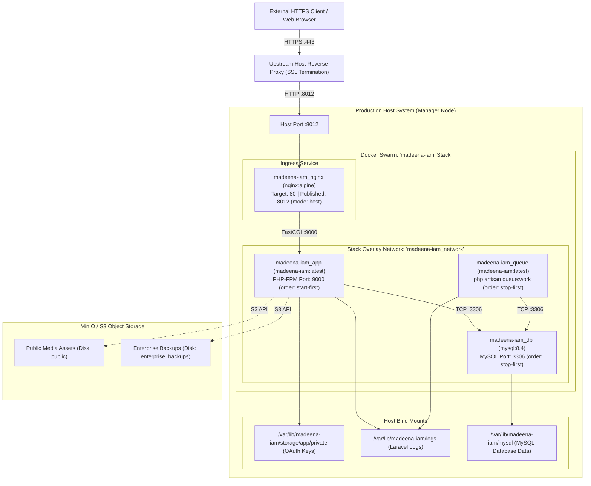

# Madeena IAM — Production Architecture & Operational Invariants

## 1. Purpose & Scope

This document specifies the production runtime topology, container orchestration configuration, networking model, and deployment workflows for `madeena-iam`.

Its objectives are:
- Providing an unambiguous reference for production service dependencies and configuration.
- Explaining the architectural rationale behind critical operational invariants (notably the `stop-first` update policy for the host-mode reverse proxy).
- Documenting the approved, automated CI/CD control path and post-deployment verification procedures.

---

## 2. Deployment & Control Path

Production operations for Madeena IAM follow a strict, automated, immutable pipeline.

```text
┌──────────────────────────────┐
│  Developer / Agent Operator  │
└──────────────┬───────────────┘
               │ Triggers workflow_dispatch via GitHub UI or gh CLI
               ▼
┌──────────────────────────────┐
│  GitHub Actions Orchestrator │
│ (.github/workflows/deploy-   │
│  swarm.yml)                  │
└──────────────┬───────────────┘
               │ Dispatches job to target runner
               ▼
┌──────────────────────────────┐
│ Self-Hosted Production Runner│ (runs-on: self-hosted)
│ 1. Builds madeena-iam:latest │
│ 2. Prepares host directories │
│ 3. Deploys Docker Swarm stack│
│ 4. Executes health checks    │
└──────────────┬───────────────┘
               │ Deploys & manages stack
               ▼
┌──────────────────────────────┐
│  Docker Swarm Manager Engine │
└──────────────────────────────┘
```

### Operational Policy Boundary
- **Approved Control Path**: All production deployments, image updates, and configuration synchronizations must be executed through GitHub Actions workflows (`deploy-swarm.yml`) running on the self-hosted production runner.
- **Prohibited Access Methods**: Direct remote administration via SSH, SCP, SFTP, remote Docker contexts (`DOCKER_HOST`), or interactive production shell sessions is explicitly prohibited for standard deployments to preserve traceability, repeatability, and audit compliance.

---

## 3. Production Runtime Topology

The following diagram illustrates how inbound traffic routes through the host reverse proxy, containerized ingress, application worker, and storage layers:



---

## 4. Swarm Services Specification

The `madeena-iam` stack is defined in [`docker-compose.prod.yml`](file:///var/www/madeena-iam/docker-compose.prod.yml) and consists of 4 distinct services:

| Service Name | Container Image | Replicas | Placement | Update Order | Rollback Order | Healthcheck Target |
|---|---|---|---|---|---|---|
| `madeena-iam_nginx` | `nginx:alpine` | 1 | `node.role == manager` | `stop-first` | `stop-first` | `wget -q --spider http://127.0.0.1/up` |
| `madeena-iam_app` | `madeena-iam:latest` | 1 | `node.role == manager` | `start-first` | `start-first` | FastCGI socket probe `127.0.0.1:9000` |
| `madeena-iam_queue` | `madeena-iam:latest` | 1 | `node.role == manager` | `stop-first` | `stop-first` | Storage directory writability check |
| `madeena-iam_db` | `mysql:8.4` | 1 | `node.role == manager` | `stop-first` | `stop-first` | `mysqladmin status` |

---

## 5. Critical Invariant: Nginx Host Port & `stop-first` Policy

### The Single-Eligible-Node Host-Port Problem
The production `nginx` service publishes port `8012` using Docker Swarm's host publication mode:
```yaml
ports:
  - target: 80
    published: 8012
    protocol: tcp
    mode: host
```

When `mode: host` is configured:
1. The container bypasses Docker Swarm's routing mesh (ingress network) and binds directly to port `8012` on the host network interface.
2. In the current production environment, the stack is placed exclusively on the single manager node (`node.role == manager`).
3. If `update_config.order` is set to `start-first` (Docker Swarm's default update policy):
   - Swarm attempts to launch the new container task **before** terminating the old container task.
   - The new container attempts to bind to host port `8012` while the running container is still actively listening on that exact port.
   - The bind fails immediately with `bind: address already in use`.
   - The new container crashes, Swarm marks the deployment as failed or enters a rollback loop, and upstream traffic receives HTTP 502 (Bad Gateway).

### The Invariant Solution: `stop-first`
To eliminate port collisions, `docker-compose.prod.yml` enforces:
```yaml
update_config:
  parallelism: 1
  delay: 5s
  order: stop-first
  failure_action: rollback
  monitor: 10s
rollback_config:
  parallelism: 1
  order: stop-first
```

### Operational Trade-off
- **Interruption Characteristic**: When rolling out a new Nginx configuration or image, `stop-first` stops the existing Nginx container before initializing the new container. This introduces a brief (typically sub-second to a few seconds) connection gap during the transition window.
- **Architectural Assessment**: This minor interruption is expected and necessary for a single-node host-mode port binding topology. True zero-downtime rolling updates require multiple eligible nodes and a multi-node load balancing layer.

---

## 6. Network Architecture

- **Stack Overlay Network**: All inter-service communication occurs across a stack-scoped overlay network named `madeena-iam_network` (`driver: overlay`, `attachable: true`).
- **Internal DNS Resolution**: Nginx dynamically resolves the PHP-FPM service using Docker's internal DNS daemon (`127.0.0.11`) configured with `set $php_upstream madeena-iam_app; fastcgi_pass $php_upstream:9000;`.
- **Database & Queue Isolation**: The MySQL database (`madeena-iam_db`) is isolated within the stack overlay network. It does not publish ports to the host interface.

---

## 7. Storage & Persistent Data Architecture

Madeena IAM implements strict data separation between host-bound persistent data and cloud-based object storage:

1. **Host Bind Mounts**:
   - `storage/app/private`: Holds cryptographically sensitive Passport OAuth keys (`oauth-private.key`, `oauth-public.key`). Permissions are restricted to `600` / `www-data`.
   - `storage/logs`: Host directory holding `laravel.log` for operational troubleshooting.
   - `var/lib/mysql`: Host directory bound to `madeena-iam_db` for MySQL data persistence.

2. **Isolated Ephemeral Framework Views**:
   - `storage/framework/views` and `storage/framework/cache` remain local to the container to prevent cache corruption between concurrent tasks.

3. **Object Storage (S3 / MinIO)**:
   - User profile images, client application logos, and system backups utilize Laravel S3 storage drivers (`public` and `enterprise_backups` disks).

---

## 8. Verification & Diagnostic Procedures

### Automated Post-Deployment Verification (8 Gates)
The production deployment workflow ([`deploy-swarm.yml`](file:///var/www/madeena-iam/.github/workflows/deploy-swarm.yml)) automatically executes 8 sequential verification checks before concluding a deployment:
1. **Service Replicas**: Verifies all 4 services report `1/1` active replicas.
2. **Container Healthchecks**: Confirms `app` and `db` health statuses report `healthy`.
3. **Update & Rollback Policy**: Validates `app` uses `start-first` and `nginx`, `db`, `queue` use `stop-first`.
4. **Resource Limits**: Checks that memory limits and reservations are configured.
5. **Queue Worker**: Verifies `queue:work` command execution and graceful shutdown periods.
6. **Storage Mounts**: Asserts that `storage/app` is mounted, `storage/framework/views` is writable and local, and root `/var/www/html/storage` is not erroneously mounted as a single block.
7. **S3 Storage Connectivity**: Invokes `php artisan storage:check` to verify S3 bucket read/write operations.
8. **Media Streaming Route**: Uploads a test probe to the `public` disk and verifies retrieval through `http://127.0.0.1:8012/storage/{probe}`.

### Production Incident Diagnostics (`diagnose-502.yml`)
In the event of connection anomalies, the read-only diagnostic workflow ([`.github/workflows/diagnose-502.yml`](file:///var/www/madeena-iam/.github/workflows/diagnose-502.yml)) allows inspecting:
- Host port `8012` connectivity (`/up` and `/admin` endpoints).
- Swarm manager state, stack tasks, and container exit codes.
- Nginx and PHP-FPM service logs.
- Network routing, overlay subnet allocations, and container IP assignments.
- Internal DNS resolution (`getent hosts app` and `nslookup madeena-iam_app 127.0.0.11`).
- FastCGI TCP connectivity from inside Nginx to PHP-FPM (`nc -z -v -w 3 madeena-iam_app 9000`).

---

## 9. Historical Incident Context & Remediation

- **Incident**: Rollout failures resulting in HTTP 502 Bad Gateway during stack updates.
- **Root Cause**: The Nginx service configuration previously utilized `update_config.order: start-first`. In a single-node host-mode port topology, this triggered an immediate port bind collision on port `8012`.
- **Resolution**: Enforced `order: stop-first` in `docker-compose.prod.yml` and `deploy-swarm.yml` (commit `be39763b73ca7ebbc59fecc4ab0be0aad78bc4a2`).
